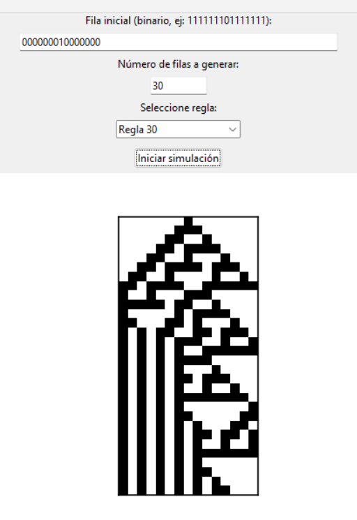

# HILARA_CALLE_CRISTIAN_RAMIRO_segundaEvaluacionAutomatas
## ⚙️ Requisitos del sistema

| Requisito | Versión recomendada | Descripción |
|------------|--------------------|--------------|
| **Python** | 3.10 o superior | Lenguaje principal del proyecto |
| **Tkinter** | Incluido con Python | Para la interfaz gráfica |
| **NumPy** | ≥ 1.26 | Generación de valores aleatorios |
| **Matplotlib** | ≥ 3.8 | Visualización de gráficos |
| **ttk (Tk themed widgets)** | Incluido | Mejor estética en la interfaz |

---

### Instalación de dependencias
#### Ejecuta los siguientes comandos en tu terminal o consola:
#### python -m venv venv
#### pip install numpy matplotlib
## NUMEROS ALEATORIOS CON DISTRIBUCION
### UNIFORME

### K-ERLANG

### EXPONENCIAL

### GAMMA

### NORMAL

### WEIBULL

## NUMEROS ALEATORIOS CON DISTRIBUCION DISCRETA
### Uniforme

### Bernoulli

### Binomial

### Poisson

# AUTOMATAS CELULARES
### XOR

### REGLA 90

### REGLA 30

# Autómata Celular - Juego de la Vida

Este proyecto implementa un autómata celular bidimensional basado en el famoso Juego de la Vida de Conway, usando Python con una interfaz gráfica interactiva creada con Tkinter. Permite definir la configuración inicial de las células mediante clics en una grilla y observar cómo evolucionan automáticamente según reglas personalizadas de vida, muerte, soledad, superpoblación y nacimiento.

## Características

- Interfaz gráfica desarrollada con Tkinter.
- Grilla interactiva de células activables/desactivables con clic del mouse.
- Simulación automática que se actualiza cada 300 milisegundos.
- Reglas de evolución personalizadas:
  - Soledad: Célula viva con 1 o menos vecinos vivos muere.
  - Superpoblación: Célula viva con 4 o más vecinos vivos muere.
  - Nacimiento: Célula muerta con exactamente 3 vecinos vivos nace.
  - Sobrevivencia: Célula viva con exactamente 2 vecinos vivos permanece viva.
- Botones de control para manejar la simulación:
  - Iniciar simulación.
  - Detener simulación.
  - Limpiar la grilla.

---

## Cómo usar

1. Ejecuta el script `juego_de_la_vida.py` (o el archivo principal del proyecto).
2. Haz clic en las células para activar o desactivarlas y definir el estado inicial.
3. Presiona **Iniciar** para comenzar la simulación.
4. Usa **Detener** para pausar la evolución.
5. El botón **Limpiar** reinicia la grilla vacía.

---

## Requisitos

- Python 3.x
- Tkinter (incluido en la mayoría de distribuciones estándar de Python)

## Referencia IA Y el youtube como ShermanSystems

